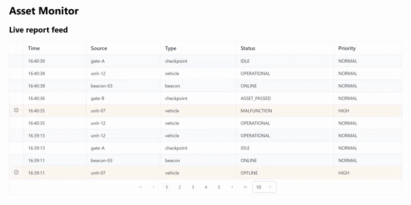

# Asset Monitor



A small demo project simulating a report aggregation and alerting system, inspired by
concepts behind operational-awareness systems (sharing and exchange of
information between sources and analysts). I built it to gain practical experience with technologies I had limited professional exposure to, including XMPP messaging, Linux/VM operations, and DevSecOps pipelines.

All data, entities, and reports in this project are entirely fictional.

## What it does

Fictional "sources" (fake sensors/units) publish structured status reports over XMPP.
A Spring Boot backend receives these reports, persists them to PostgreSQL, applies a
simple priority rule, and pushes updates to an Angular frontend in real time over
WebSocket. The frontend shows a live aggregated feed and highlights high-priority
reports.

## Architecture

```
[Fake sources] --XMPP--> [XMPP server] --XMPP--> [Spring Boot backend] --WebSocket--> [Angular frontend]
                                                          |
                                                     [PostgreSQL]
```

- **Fake sources**: a Python script (`fake-sources/generator.py`) simulating five
  fictional sensors (e.g. `unit-07`, `gate-B`), each with its own XMPP account,
  publishing JSON reports on an independent, jittered timer
- **XMPP server**: ejabberd (containerized), the messaging backbone between sources
  and the backend
- **Backend**: Spring Boot, connects to XMPP as a listening client (Smack library),
  classifies each report's priority, persists it to PostgreSQL via Spring Data JPA,
  and broadcasts it to connected frontends over WebSocket (STOMP)
- **Database**: PostgreSQL, containerized, with a persistent volume
- **Frontend**: Angular + PrimeNG, subscribes over WebSocket, shows a live paginated
  feed table, and visually highlights high-priority reports

## Why these technologies

This project exists specifically to build working familiarity with the following technologies:

- **XMPP**: the source-to-backend messaging protocol
- **Linux / virtualization**: entire stack runs on a self-managed Ubuntu VM
  (VirtualBox + Vagrant), provisioned declaratively rather than set up manually
- **DevSecOps**: CI/CD pipeline with automated tests and dependency/security
  scanning

## Running the project

Two ways to run the full project:

### A) Docker

```bash
docker compose up -d
```

Runs backend, frontend, fake-sources, xmpp, and db together as containers, locally.
Simplest way to see the whole thing working end to end.

- Frontend: http://localhost:4200
- Backend health check: http://localhost:8080/api/health
- ejabberd admin UI: http://localhost:5280/admin (`admin@localhost` / `changeme`)
- Postgres: `localhost:5432`, database `assetmonitor`, user `assetmonitor`

Stop with `docker compose down` (add `-v` to also wipe the Postgres volume).

### B) Vagrant VM (production-like setup)

Prerequisites: [VirtualBox](https://www.virtualbox.org/wiki/Downloads),
[Vagrant](https://developer.hashicorp.com/vagrant/downloads).

```bash
vagrant up
```

Provisions a full Ubuntu VM, installs Docker inside it, and runs the exact same
`docker compose up -d` against this project folder 
; a closer approximation of a real deployment target than running
Docker directly on your host. Same access URLs as above, reachable from your host
machine via the Vagrantfile's port forwarding.

```bash
vagrant provision       # redeploy after code changes
vagrant destroy -f && vagrant up   # fully clean rebuild
vagrant halt / up / ssh / destroy  # manage the VM
```

### C) Local development

If you're actively editing backend or frontend code, a full Docker rebuild per change
is slow. Keep `xmpp`/`db` in Docker, run everything else natively:

```bash
docker compose up -d xmpp db

cd backend && mvn spring-boot:run -Dspring-boot.run.profiles=local
cd frontend && npm install && npm start
cd fake-sources && pip install -r requirements.txt && python generator.py
```

The `local` Spring profile points `xmpp`/`db` at `localhost` instead of their
Docker-internal hostnames, since those only resolve inside the Compose network.
